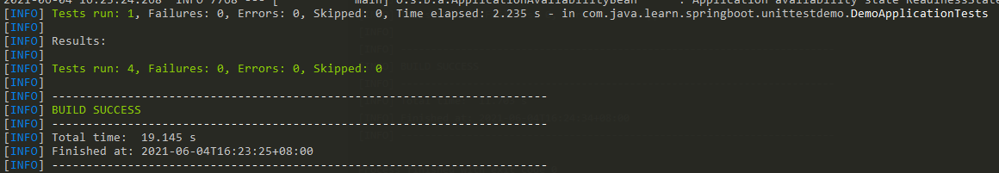
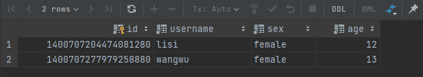

# SpringBoot2.x+H2进行单元测试

### 1. 整体描述

* 整体项目使用 SpringBoot2.x、MySQL实现。
* 使用到的插件：hutool、mybatis-plus、liquebase、lombok、h2。
* 项目主要为展示如何使用 h2 内存数据库进行单元测试的边写，不会对参数进行有效性检测，尽可能简化逻辑！不会对其他插件进行详细讲解。
* 使用 liquebase 进行数据库结构的管理，使用 mybatis-plus 简化数据库操作。
* 为了防止单元测试产生很多垃圾数据，使用 h2 内存数据库，测试之后，数据销毁。

### 2. 项目 demo 地址

* https://gitee.com/zp95sky/java-learn-demo/tree/master/my-space-server

### 3. 关键搭建过程

#### 3.1. 添加 h2 依赖

```xml
<dependency>
	<groupId>com.h2database</groupId>
	<artifactId>h2</artifactId>
</dependency>
```

#### 3.2. 添加 MyBatisPlus 配置文件，配置 test 环境使用 H2 内存数据库

```java
@Bean
public MybatisPlusInterceptor mybatisPlusInterceptor() {
	MybatisPlusInterceptor interceptor = new MybatisPlusInterceptor();

	String[] activeProfiles = applicationContext.getEnvironment().getActiveProfiles();
	if (ArrayUtil.contains(activeProfiles, "test")) {
        // 单元测试，使用 h2 数据库，防止 mysql 中存在垃圾数据
        interceptor.addInnerInterceptor(new PaginationInnerInterceptor(DbType.H2));
	} else {
		interceptor.addInnerInterceptor(new PaginationInnerInterceptor(DbType.MYSQL));
	}
	return interceptor;
}
```

#### 3.3. 添加 test 环境配置文件：application-test.yml，使用 h2 数据库

```yaml
spring:
  datasource:
    url: jdbc:h2:mem:unit_test
    username: admin
    password: 123456
    driver-class-name: org.h2.Driver

  # h2 页面控制台，可以选择性添加
  h2:
    console:
      enabled: true
      path: /h2-console
```

#### 3.4. 添加 User 实体，添加针对 User 的增、查、删操作

* 此处不进行详细过程说明，就是常用的 entity、mapper、service、controller 添加，可在 demo 中查看。

#### 3.5. 测试文件编写，指定激活环境为 test。

```java
@SpringBootTest
@ActiveProfiles({"test"})
@AutoConfigureMockMvc
@Slf4j
public class UserControllerTest {
	// ......
}
```

### 4. 测试结果

#### 4.1. 直接运行单元测试

* 可以使用 maven 命令 `maven test` 进行测试。

  

* 也可以通过编辑器进行测试。

* 操作完可以看到，我们的 MySQL 数据库中并没有产生任何数据。

#### 4.2. 通过手动调用进行测试

* 启动项目，不指定启动环境（默认环境为 `default`），通过 postman 进行测试。

* 查看数据库。

  

* 可以看到数据库中有数据产生。

